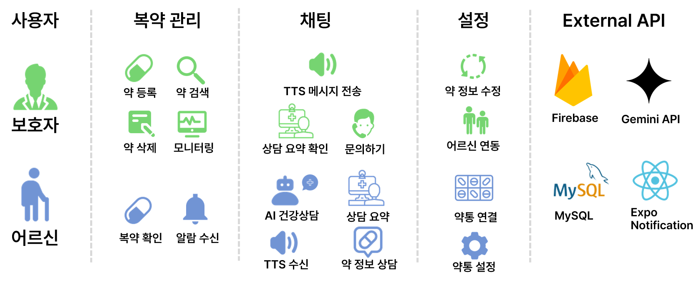
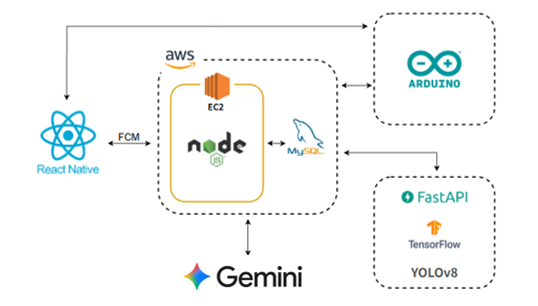
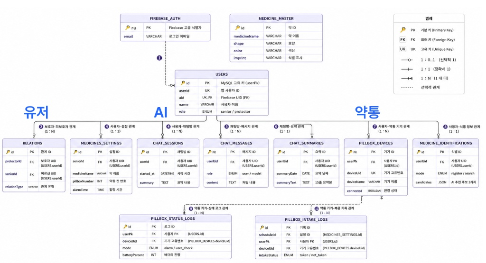
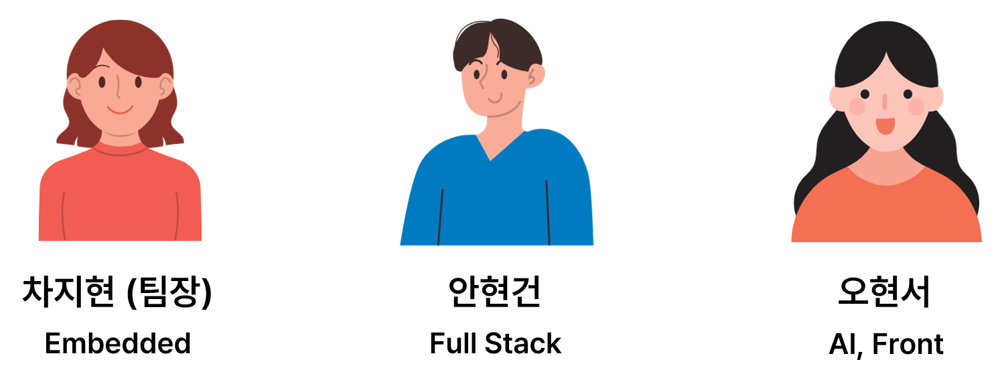

  <h1>💊 지켜약 </h1>
  
<b>AI 기반 IoT 스마트 약통 연동 맞춤 케어 서비스</b>

   

---

## 📢 1. 프로젝트 개요

**지켜약**은 고령화 시대에 어르신들의 낮은 복약 순응도 문제를 해결하기 위해 기획된 올인원 시니어 케어 플랫폼입니다. AI와 IoT 기술을 융합하여 안전한 복약 케어를 구현하는 것이 핵심입니다.

### 🚨 기획 배경
* **만성질환 유병률 증가:** 성인 기준 고혈압 30.7%, 당뇨병 14.8% (2024 국민건강통계)
* **심각성:** 복약순응도 저하 관련 연간 사망자 12.5만 명 발생 (CDC)
* **경제적 손실:** 복약 미준수로 인한 의료비 낭비 14.0% (영국)

### 🎯 목표 및 기대효과
* **목표:** 스마트 약통으로 복약 누락을 방지하고, AI 상담 및 보호자 연동 케어 제공
* **기대효과:** 어르신의 복약 순응도 향상, 건강 증진 도모 및 보호자의 돌봄 부담 경감

---

## ✨ 2. 핵심 기능

  

 

지켜약은 **보호자**와 **어르신**의 사용 환경을 분리하여 맞춤형 기능(UI)을 제공합니다.

### 👨‍👩‍👧‍👦 사용자별 맞춤 기능
* **보호자:** 약 등록, 약 검색, 약 삭제, 모니터링(복약 확인, 알람 수신), 어르신 연동 및 약통 설정, TTS 메시지 전송 기능 제공
* **어르신:** 직관적인 복약 확인 및 알람 수신, AI 건강상담 및 약 정보 상담, 상담 요약, TTS 수신 지원

### 🚀 특화 기술
* **📸 약 구별 사진 AI:** 사진 분석을 통해 약을 식별하는 기능 제공
* **💬 AI 복약 상담 (Chatbot):** AI 건강상담 및 약 정보 상담 진행, 상담 요약 기능 제공
* **📡 약통 실시간 감지 및 사용자 연결:** 스마트 약통을 통한 실시간 복약 관리 연동

---

## 💡 3. 경쟁 서비스 분석

기존 복약 알림 시스템의 한계를 극복하고, 자동화된 맞춤 관리를 제공합니다.

| 비교 항목 | 기존 시스템 (복약복약, 건강안전 보이스케어) | **지켜약** |
| :--- | :--- | :--- |
| **복약 확인** | 수동 입력 | **센서 자동인식** |
| **알림 방식** | 단순 알림 | **단계적 대응 시스템** |
| **데이터 활용** | 기록 중심 | **분석 기반 관리** |
| **편의성** | 낮음 | **AI 자동화 (높음)** |
| **보호자 기능** | 제한적 | **실시간 관리 지원** |
| **접근성** | 낮음 | **높음** |

---

## 🛠 4. 시스템 아키텍처 및 DB 설계 (Architecture & ERD)

### 시스템 구성도 

  

 

* **Frontend (App):** React Native, Expo Notification
* **Backend & Server:** Node.js, EC2, FastAPI
* **Database:** MySQL, Firebase
* **AI & Vision:** Gemini API, TensorFlow, YOLOv8
* **Hardware (IoT):** Arduino, Bluetooth

### 데이터베이스 ERD 

   
  

---

## 🚀 5. 향후 개발 계획 (하계 방학 계획)

프로젝트 고도화를 위해 파트별 세부 개발 계획을 수립하여 진행합니다.

| 파트 | 세부 작업 목표 |
| :--- | :--- |
| **🤖 AI 파트** | 사진 AI 개발, 채팅 AI 개선, e약은요 API 연동|
| **🔌 임베디드** | MQTT 통신 완성, 블루투스 거리 이탈 대응, 약통케이스 조립 |
| **📱 프론트엔드** | 보호자 관리 UI, 블루투스 연결관리, 통계 기능 구현|

---

## 👥 6. 팀원 소개 (Team :8080)

  

 

## 📁 7. 프로젝트 산출물 및 시연 영상

- [**프로젝트 계획서 ppt**](#)
- [**프로젝트 완성 발표 ppt**](#)
- [**시연 동영상 (youtube 동영상 링크)**](https://www.youtube.com/)

 
